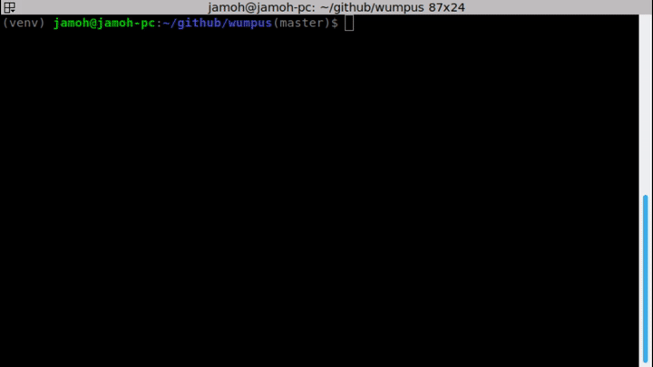

## Jamofer's fork in python



### Install instructions:
* Required python version: python3.7
```bash
pip install -U .
pip install pytest

# Alternative Docker version
docker build -t wumpus-game
```

### Run unit tests:
```bash
pytest .
```

### Run the game:
```bash
./wumpus_game.py

# Alternative Docker version
docker run -it wumpus-game
```
wumpus
======

A simple test designed for the interview process at Connected Health Services. 

Please fork this repo in your account and develop a Java program that implements the rules for the Wumpus Game (see included Powerpoint). You are expected to write the complete game logic, and use simple text interactions to drive the game play (like the text-based adventure games from the old days, http://en.wikipedia.org/wiki/Text-based_game).

Bonus points for unit tests ;).

Please use Eclipse as your IDE and whatever version of Java you are most confortable with (Scala or Groovy also welcomed). Use whatever framework you prefer for your unit tests.
